 # E-Commerce Platform with Microservices Architecture.

## Capstone Project: E-Commerce Platform with Microservices Architecture.

**Hypothetical Use Case**

You are tasked with developing an e-commerce platform using a microservices-based architecture. The Platform consists of several microservices:

   - **Product Service:** Manages product information.

   - **Cart Service:** Handles user shopping carts.

   - **Order Service:** Manages order processing.


The goal is to containerize these microservices using Docker, Deploy them to a Kubernetes cluster managed by ArgoCD, and expose them through an API Gateway.

## Tasks

### Task 1: Project Setup:

   - Create a new project directory named `e-commerce-platform`.

   - Inside, create subdirectories for each microservice: `product-service`, `cart-service`, `order-service`.

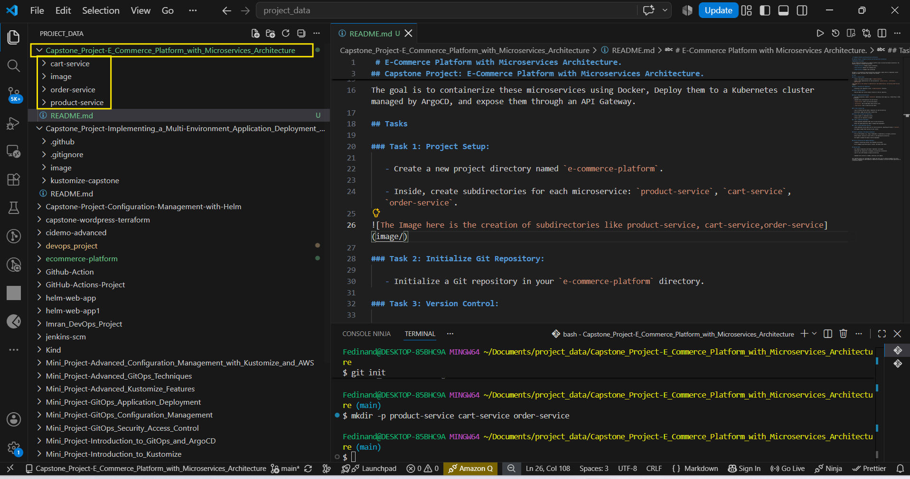

### Task 2: Initialize Git Repository:

   - Initialize a Git repository in your `e-commerce-platform` directory.

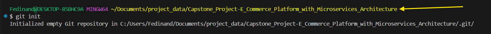

### Task 3: Version Control:

   - Add and commit your initial project structure to the Git repository.

### Task 4: Dockerize Microservices:

   - For each microservice, create a `Dockerfile` specifying a base image (e.g., Python/Flask or Node.js/Express).

   - Implement basic functionalities for each service:

   - `product-service`: API to list and view products.

   - `cart-service`: API to add/remove items to/from a cart.

   - `order-service`: API to create and view orders.

The structure displays the microservice arrangement.

```
Capstone_project-E_commerce_platform_with_microservices_architecture/
│
├── product-service/
│   ├── Dockerfile
│   ├── package.json
│   ├── package-lock.json
│   └── server.js
│
├── cart-service/
│   ├── Dockerfile
│   ├── package.json
│   ├── package-lock.json
│   └── server.js
│
└── order-service/
    ├── Dockerfile
    ├── package.json
    ├── package-lock.json
    └── server.js
```
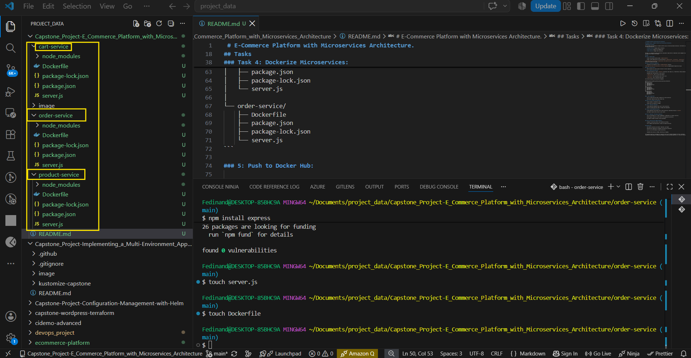

### 5: Push to Docker Hub:

   - Log in to Docker Hub and create a repository for each microservice.

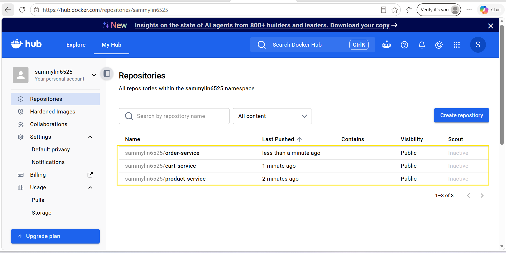

   - Build Docker images and push them to Docker Hub.

The Image here show the ci of the microservices on the pipeline to build container image.

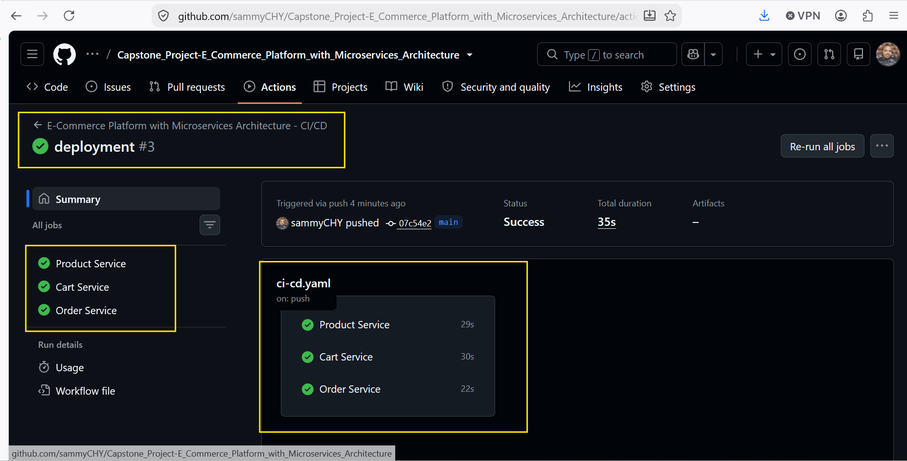


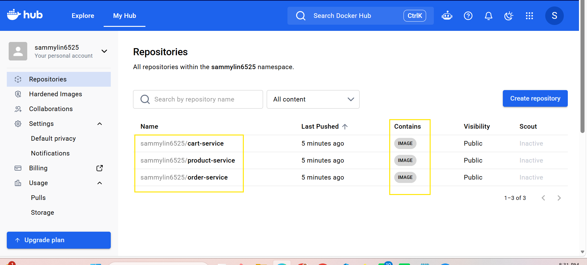

### Task 6: Set up ArgoCD with Kubernetes:

   - Install ArgoCD in a Kubernetes cluster.

In this case, I have to argocd namespace with this command below.

`kubectl create namespace argocd` Thereafter, argocd has to be installed in the minikube cluster.

```
kubectl apply -n argocd --server-side --force-conflicts \
  -f https://raw.githubusercontent.com/argoproj/argo-cd/stable/manifests/install.yaml
```
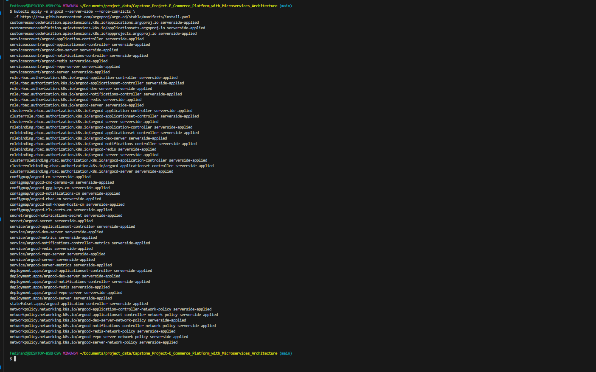

After the installation I have to confirm if the argocd is deployed in the minikube cluster.

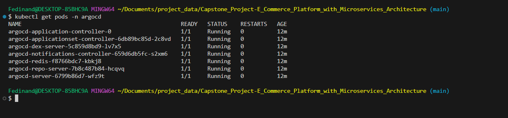
  
   - Connect your Git repository to ArgoCD.
Access Argo CD on Minikube.
Run:

```
kubectl port-forward svc/argocd-server -n argocd 8080:443
```
The open using 

```
https://localhost:8080
```

Get the initial admin password with the command below.

```
kubectl -n argocd get secret argocd-initial-admin-secret \
  -o jsonpath="{.data.password}" | base64 -d
```

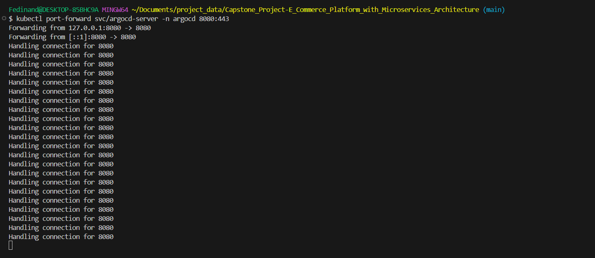

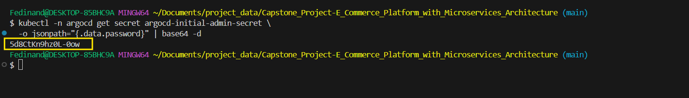

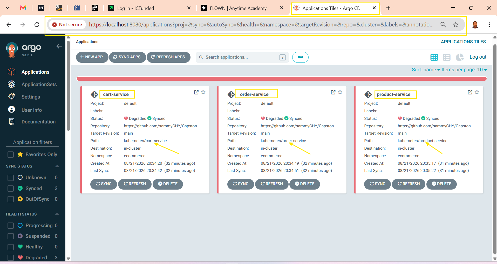

###  Task 7: Kubernetes Deployment:

   - Create kubernetes deployment YAML files for each microservice.

   - Define the ArgoCD application YAMLs to manage these deployments.
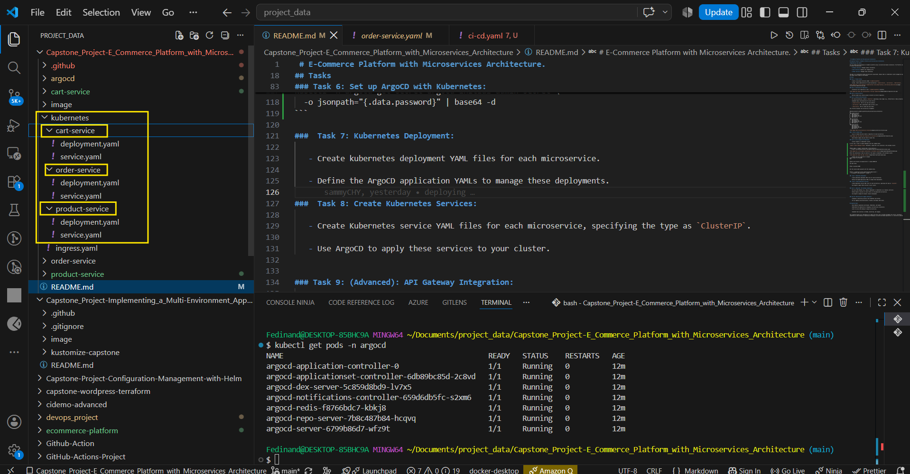

###  Task 8: Create Kubernetes Services:

   - Create Kubernetes service YAML files for each microservice, specifying the type as `ClusterIP`.

   - Use ArgoCD to apply these services to your cluster.


### Task 9: (Advanced): API Gateway Integration:

   - Set up an API Gateway (e.g., Kong or Ambassador) in Kubernetes as an Ingress controller.

      Install Kong: for Minikube, then Kong has to be installed using its official Helm chart.

      First check if helm is installed by running this command: `helm version` but If helm is not installed, install it first.

      Add the kong Helm repository:

   ```
   helm repo add kong https://charts.konghq.com
   ```
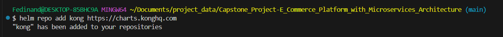
   
   Then: 

   ```
   helm repo update
   ```  
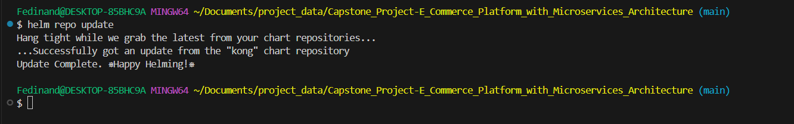

   Create a namespace:

```
kubectl create namespace kong
```

Then Install Kong:

```
helm install kong kong/ingress \
  --namespace kong \
  --set gateway.enabled=true \
  --set ingressController.enabled=true
``` 
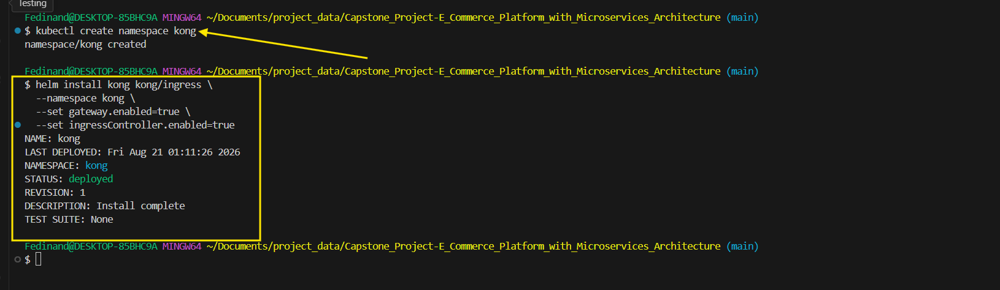

   Check:

```
kubectl get pods -n kong
```
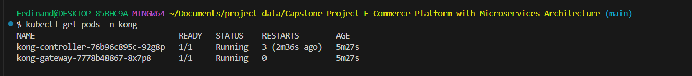


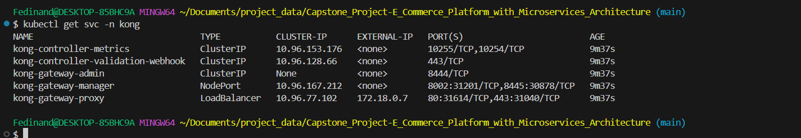

   - Define Ingress resources to route traffic to the appropriate microservice.

   - Use ArgoCD to manage the Ingress resource deployment.


### Task 10: Monitoring and Logging (Optional):

   - Integrate a monitoring solution like Prometheus and Grafana.

      Create a monitoring namespace

```
kubectl create namespace monitoring
```
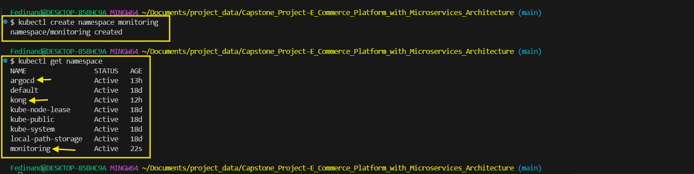

Add the Prometheus Helm repository

```
helm repo add prometheus-community https://prometheus-community.github.io/helm-charts
```

Then:

`helm repo update`

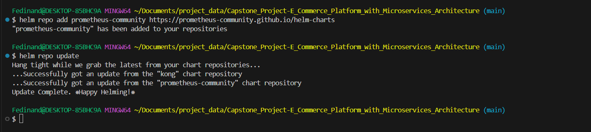

Install Kube-Prometheus-stack

Run:  

```
helm install monitoring prometheus-community/kube-prometheus-stack \
  --namespace monitoring
```
The stack install Prometheus and Grafana along with Kubernetes Monitoring components.

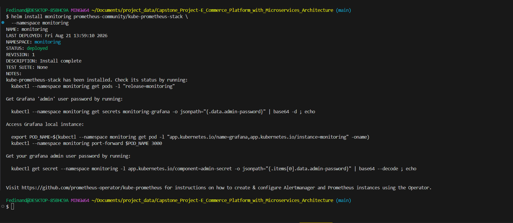

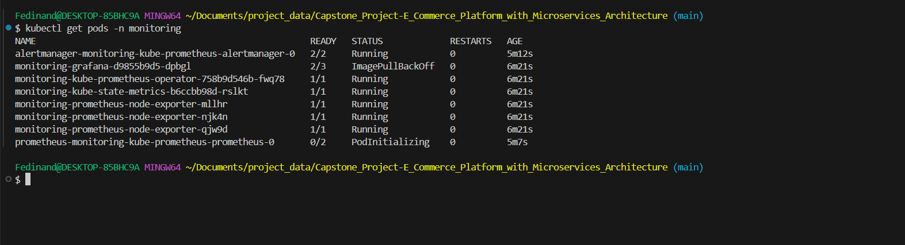

      Check Prometheus

      Run:
   kubectl get svc -n monitoring

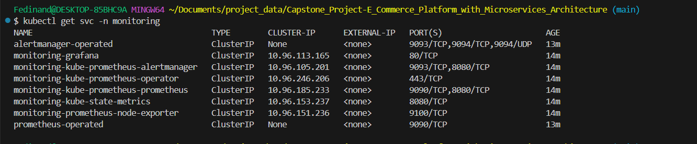

To access Prometheus locally, use Port-forwarding:

```
kubectl port-forward -n monitoring \
  svc/monitoring-kube-prometheus-prometheus 9090:9090
```
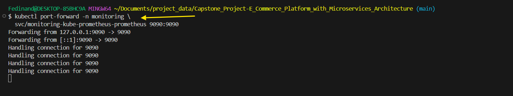

Then Open:

```
http://localhost:9090
```


You should see the Prometheus web interface.

### Next step Check Grafana.

First find the Grafana service:

```
kubectl get svc -n monitoring | grep grafana
```
You should see something similar to:

`monitoring-grafana`


Then:

```
kubectl port-forward -n monitoring \
  svc/monitoring-grafana 3000:80
```
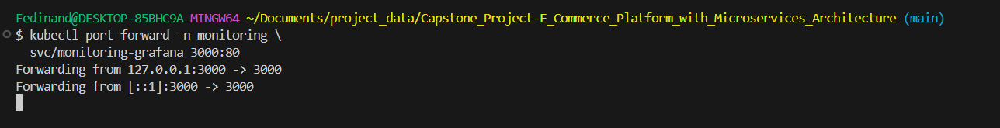

Open:

```
http://localhost:3000
```
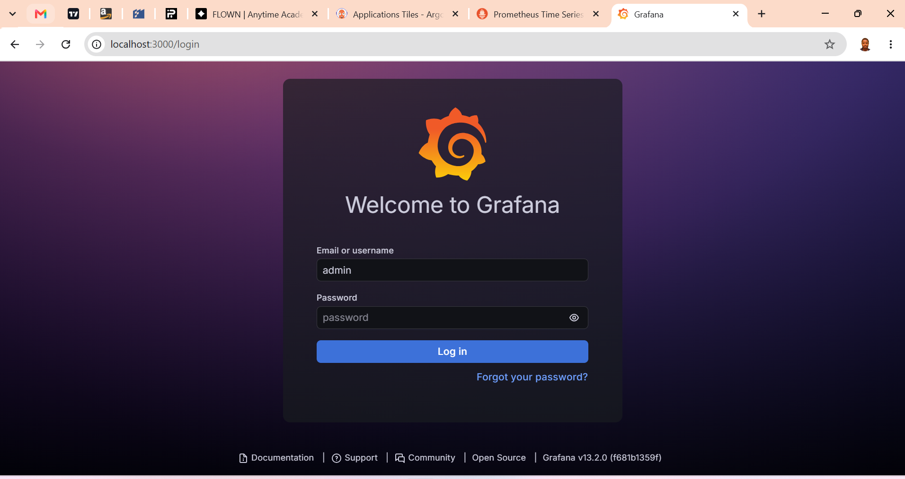
You should see the Grafana login page.

The Helm installation creates a Kubernetes Secret containing the Grafana admin password.

Run:

```
kubectl get secret -n monitoring monitoring-grafana \
  -o jsonpath="{.data.admin-password}" | base64 --decode
```
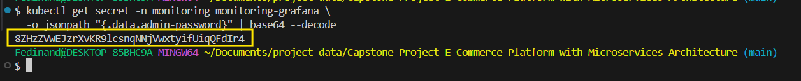

Copy the password.

Your initial username is usually:

`admin`

So log in at:

```
http://localhost:3000
```

```
Username: admin
Password: <password-you-retrieved>
```
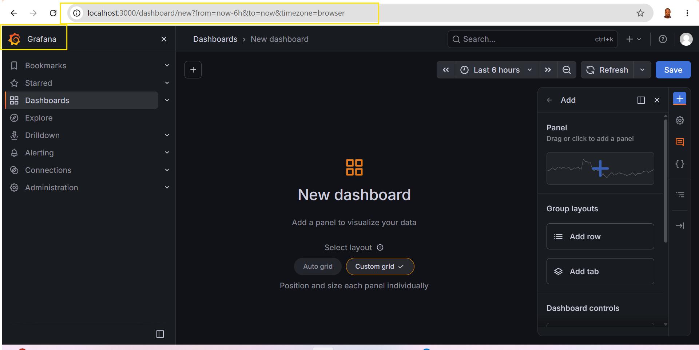

   - Set up logging using Elasticsearch, Fluentd, and Kibana (EFK stack).

At this point I will not be able to deploy the setup above because I'm using minikube for this project but the whole procedures will be explained below.

EFK can use considerably more resources than your microservices.

Check: 

`minikube status`

Then: 

`kubectl get nodes`

If Minikube is short on memory, you may need to increase it. For example:

```
minikube stop
minikube start --memory=6144 --cpus=4
```
In this case you don't necessarily need exactly those values; use what your computer can comfortably provide.

Create a logging namespace

Create:

`kubectl create namespace logging`

Verify:

`kubectl get namespace logging`

Your cluster will now have:

```
ecommerce
   │
   ├── product-service
   ├── cart-service
   └── order-service

logging
   │
   ├── Elasticsearch
   ├── Fluentd
   └── Kibana
```

Deploy Elasticsearch.

For this local/demo capstone, we 'll run one Elasticsearch node.
Create: `kubernetes/logging/elasticsearch.yaml`

```
apiVersion: v1
kind: Service
metadata:
  name: elasticsearch
  namespace: logging
spec:
  selector:
    app: elasticsearch
  ports:
    - port: 9200
      targetPort: 9200
  type: ClusterIP

---

apiVersion: apps/v1
kind: Deployment
metadata:
  name: elasticsearch
  namespace: logging
spec:
  replicas: 1
  selector:
    matchLabels:
      app: elasticsearch
  template:
    metadata:
      labels:
        app: elasticsearch
    spec:
      containers:
        - name: elasticsearch
          image: docker.elastic.co/elasticsearch/elasticsearch:8.17.1
          ports:
            - containerPort: 9200
            - containerPort: 9300

          env:
            - name: discovery.type
              value: single-node

            - name: xpack.security.enabled
              value: "false"

            - name: ES_JAVA_OPTS
              value: "-Xms512m -Xmx512m"

          resources:
            requests:
              memory: "1Gi"
              cpu: "500m"

            limits:
              memory: "2Gi"
              cpu: "1"
```

Deploy Elasticsearch.
For the test, it can be apply manually.
```
kubectl apply -f kubernetes/logging/elasticsearch.yaml
```
Then Check:

```
kubectl get pods -n logging
```
In this case you should eventually see:
`elasticsearch-xxxxxxxxxxxx 1/1 Running`

Check the Service:

`kubectl get svc -n logging`

You should see:

`elasticsearch ClusterIP ......  9200/TCP`

Then open another terminal and run:

```
curl http://localhost:9200
```


Test Elasticsearch

Run:

`kubectl port-forward -n logging svc/elasticsearch 9200:9200`

Deploy Fluentd

In this case we need the component that collects the Kubernetes container logs.  The official Fluentd Kubernetes documentation recommends running Fluentd as a `DaemonSet` because a DaemonSet places a Fluentd pod on each Kubernetes node.

The Fluentd Kubernetes DaemonSet project currently provides images specifically built with Elasticsearch 8 and Elasticsearch 9 support.

```
kubernetes/logging/fluentd.yaml
```
For the Minikube setup, use:

```
apiVersion: v1
kind: ServiceAccount
metadata:
  name: fluentd
  namespace: logging

---

apiVersion: rbac.authorization.k8s.io/v1
kind: ClusterRole
metadata:
  name: fluentd
rules:
  - apiGroups:
      - ""
    resources:
      - pods
      - namespaces
    verbs:
      - get
      - list
      - watch

---

apiVersion: rbac.authorization.k8s.io/v1
kind: ClusterRoleBinding
metadata:
  name: fluentd
roleRef:
  kind: ClusterRole
  name: fluentd
  apiGroup: rbac.authorization.k8s.io
subjects:
  - kind: ServiceAccount
    name: fluentd
    namespace: logging

---

apiVersion: v1
kind: ConfigMap
metadata:
  name: fluentd-config
  namespace: logging
data:
  fluent.conf: |
    <source>
      @type tail
      path /var/log/containers/*.log
      pos_file /var/log/fluentd-containers.log.pos
      tag kubernetes.*
      read_from_head true

      <parse>
        @type cri
      </parse>
    </source>

    <filter kubernetes.**>
      @type kubernetes_metadata
    </filter>

    <match kubernetes.**>
      @type elasticsearch
      host elasticsearch.logging.svc.cluster.local
      port 9200

      logstash_format true
      logstash_prefix kubernetes

      include_tag_key true
      tag_key @log_name

      <buffer>
        flush_interval 5s
      </buffer>
    </match>

---

apiVersion: apps/v1
kind: DaemonSet
metadata:
  name: fluentd
  namespace: logging
spec:
  selector:
    matchLabels:
      app: fluentd

  template:
    metadata:
      labels:
        app: fluentd

    spec:
      serviceAccountName: fluentd

      tolerations:
        - operator: Exists

      containers:
        - name: fluentd
          image: fluent/fluentd-kubernetes-daemonset:v1.19.3-debian-elasticsearch8-1.1

          env:
            - name: FLUENT_UID
              value: "0"

          resources:
            requests:
              memory: "200Mi"
              cpu: "100m"

            limits:
              memory: "500Mi"
              cpu: "500m"

          volumeMounts:
            - name: varlog
              mountPath: /var/log

      volumes:
        - name: varlog
          hostPath:
            path: /var/log
```
The Fluentd project documents the Elasticsearch-specific kubernetes DaemonSet images and the use of `/var/log/containers/*.log` for container log collection.

Apply Fluentd

```
kubectl apply -f kubernetes/logging/fluentd.yaml
```
Check:

```
kubectl get pods -n logging
```
You should now have something like:
```
elasticsearch-xxxxx   1/1   Running
fluentd-xxxxx         1/1   Running
```
Check the DaemonSet:

```
kubectl get daemonset -n logging
```
You want:

```
DESIRED   CURRENT   READY
1         1         1
```
Because you're using a single-node Minikube cluster.

### Check Fluentd logs.

This is very useful for troubleshooting:

```
kubectl logs -n logging daemonset/fluentd
```
You want Fluentd to start without errors.

If you see Elasticsearch connection errors, check:

```
kubectl get svc -n logging
```
and:

```
kubectl get pods -n logging
```

### Deploy Kibana
Now we need the UI where you will actually search and view your logs.

Create:

```
kubernetes/logging/kibana.yaml
```

Use:

```
apiVersion: v1
kind: Service
metadata:
  name: kibana
  namespace: logging
spec:
  selector:
    app: kibana

  ports:
    - port: 5601
      targetPort: 5601

  type: ClusterIP

---

apiVersion: apps/v1
kind: Deployment
metadata:
  name: kibana
  namespace: logging
spec:
  replicas: 1

  selector:
    matchLabels:
      app: kibana

  template:
    metadata:
      labels:
        app: kibana

    spec:
      containers:
        - name: kibana
          image: docker.elastic.co/kibana/kibana:8.17.1

          ports:
            - containerPort: 5601

          env:
            - name: ELASTICSEARCH_HOSTS
              value: '["http://elasticsearch.logging.svc.cluster.local:9200"]'

          resources:
            requests:
              memory: "500Mi"
              cpu: "250m"

            limits:
              memory: "1Gi"
              cpu: "1"
```
Deploy Kibana

```
kubectl apply -f kubernetes/logging/kibana.yaml
```
Check:

```
kubectl get pods -n logging
```
You should eventually have:

```
elasticsearch-xxxxx   1/1   Running
fluentd-xxxxx         1/1   Running
kibana-xxxxx          1/1   Running
```
Kibana can take a little while to start.

Access Kibana

Run: 

```
kubectl port-forward -n logging svc/kibana 5601:5601
```
Then Open:

```
http://localhost:5601
```
You should see the Kibana interface.

## Capstone Goals 

   - Gain hands-on experience with Docker, Kubernetes, and ArgoCD.

   - Understand the complexities of managing a microservices architecture.

   - Learn to use an API Gateway to expose microservices.

   
   - Implement best practices in DevOps, monitoring, and logging.


This capstone project will challenge you to apply the skills you've learned throughout the course, providing a comprehensive understanding of deploying and managing a microservices-based application in a real-world scenario. 